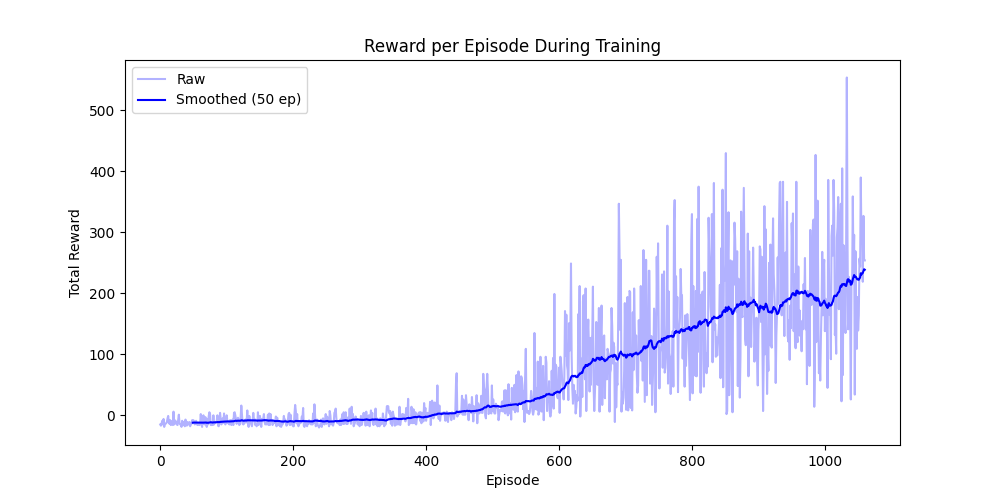
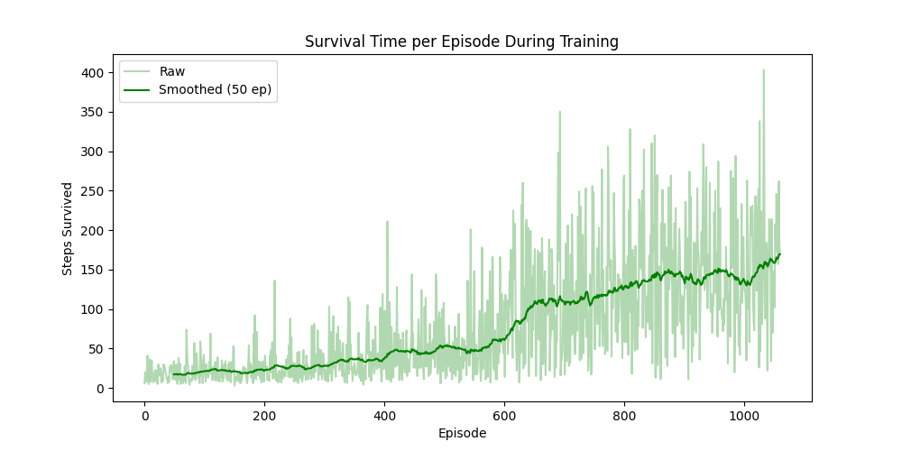

# Reinforcement Learning Snake Agent

An undergraduate research project investigating how reinforcement learning agents learn to play Snake using **Proximal Policy Optimization (PPO)**.

This project was completed as part of the **CRA UR2PhD Undergraduate Research Program** at UNC Charlotte.

---

# Overview

The objective of this research was to investigate how a reinforcement learning agent develops strategies over time while playing Snake. Rather than focusing solely on maximizing the final score, the project explored how different reward structures and environment configurations influence the learning process.

A custom Snake environment was developed using **Gymnasium**, and a **PPO (Proximal Policy Optimization)** agent from **Stable-Baselines3** was trained across multiple experiments. Training performance was evaluated through quantitative metrics and visualizations to better understand the agent's behavior throughout learning.

---

# Research Objectives

- Train a reinforcement learning agent to play Snake.
- Evaluate how reward shaping influences learning.
- Analyze agent performance across multiple training runs.
- Visualize learning progress using experimental data.
- Investigate the strengths and limitations of PPO in a custom environment.

---

# Repository Structure

```text
RL-Snake-Agent/

├── snake_env.py      # Custom Gymnasium Snake environment
├── train.py          # PPO training script
├── evaluate.py       # Model evaluation
├── watch.py          # Watch the trained agent play
├── plot.py           # Generate training graphs
├── test_env.py       # Manual environment testing
├── graphs/           # Experimental results and figures
└── README.md
```

---

# Environment

The Snake game was implemented as a custom Gymnasium environment featuring:

- 20 × 20 playing grid
- Relative action space
  - Move Straight
  - Turn Left
  - Turn Right
- 11-dimensional observation space describing:
  - Immediate danger
  - Current movement direction
  - Relative food location
- Reward shaping encouraging efficient movement toward food while penalizing collisions and poor movement.

---

# Training

The reinforcement learning agent was trained using:

- Stable-Baselines3
- PPO (Proximal Policy Optimization)
- MlpPolicy neural network
- 1,000,000 training timesteps

Training statistics were recorded using Gymnasium's Monitor wrapper and later analyzed using custom plotting scripts.

---

# Evaluation

The repository includes tools for:

- Evaluating trained models
- Visualizing reward curves
- Inspecting agent gameplay
- Comparing experimental configurations

---

---

# Experimental Results

The following plots summarize the learning progress of the PPO agent during training.

## Reward Per Episode During Training



The reward curve demonstrates a clear upward trend throughout training. While reinforcement learning naturally exhibits variability between episodes, the smoothed moving average shows that the PPO agent consistently improved its policy over time.

---

## Survival Time During Training



The survival-time curve shows that the agent remained alive for progressively longer periods as training continued. This indicates that the learned policy became increasingly effective at avoiding collisions while successfully navigating toward food.

---

## Experimental Summary

| Experiment | Average Score | Average Survival | Maximum Score | Observation |
|------------|--------------:|-----------------:|--------------:|-------------|
| Baseline (20×20, shaped rewards) | 17.42 | 306.12 | 47 | Stable baseline performance |
| Simple reward structure | 19.14 | 353.68 | — | Higher performance with lower variance |
| Smaller grid (10×10) | 14.37 | 151.76 | — | Faster but more constrained learning |

---

## Key Findings

- Simpler reward structures produced more stable learning behavior.
- Reward shaping significantly influenced both convergence speed and overall performance.
- Smaller environments accelerated learning but limited long-term performance.
- Evaluating reinforcement learning agents requires multiple performance metrics rather than relying solely on the final score.

# Technologies

- Python
- Gymnasium
- Stable-Baselines3
- NumPy
- Matplotlib
- Pygame

---

# My Contributions

As an undergraduate researcher, my primary responsibilities included:

- Designing reinforcement learning experiments
- Modifying reward functions and evaluation parameters
- Training and evaluating PPO agents
- Collecting experimental performance metrics
- Creating graphs and visualizations
- Interpreting experimental results
- Co-authoring the research paper and presentation

---

# Collaborator Contributions

The project was completed collaboratively.

Major contributions from my research partner included:

- Designing the custom Snake Gymnasium environment
- Implementing the reinforcement learning framework
- Developing the PPO training pipeline

---

# Acknowledgements

This project was completed as part of undergraduate research at **UNC Charlotte** through the **CRA UR2PhD Undergraduate Research Program**.

Special thanks to my research partner and faculty mentor for their guidance and collaboration throughout the project.
